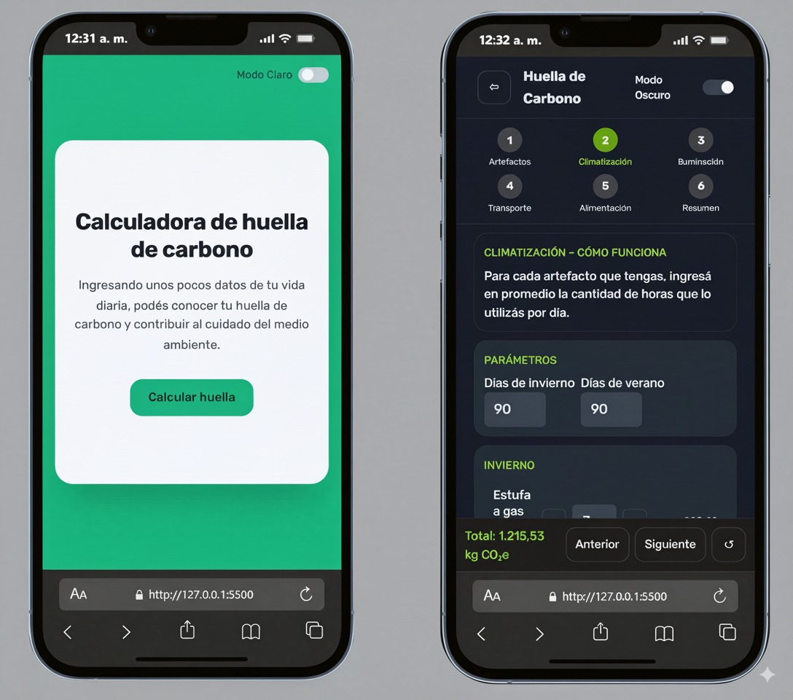

 # Calculadora de Huella de Carbono Personal


Una calculadora web para estimar la huella de carbono personal a partir de los hábitos de consumo diario y anual, creada con HTML,Tailwind CSS y JavaScript.

## Descripción
Esta aplicación web sirve para que los usuarios puedan calcular su huella de carbono personal en base a sus distintos hábitos de consumo. Permite ingresar datos sobre el uso de artefactos, climatización, transporte, iluminación y alimentos para obtener un total de kilogramos de CO2 equivalente.

### Funcionalidades Principales
**Cálculo de Consumo**: Estima la huella de carbono generada por el consumo de energía de diferentes artefactos y sistemas de climatización.

**Análisis de Transporte**: Calcula la huella según los medios de transporte utilizados y la distancia recorrida.

**Impacto de Alimentos**: Permite considerar la huella de carbono asociada al consumo de distintos tipos de alimentos.

**Visualización de Resultados**: Muestra el total de kg CO2e y su equivalencia en otros indicadores, como la cantidad de árboles necesarios para compensarla.

**Navegación Intuitiva**: Interfaz de usuario con un sistema de pasos para guiar al usuario a través del proceso de cálculo.

## Contexto Educativo

Este proyecto fue desarrollado por **Augusto Rodríguez,
Rolando Villegas,
Tomas Opazo,
Nadia Mellao**, estudiantes de la materia **Programación Front End** del **Instituto Técnico Superior (ITS) de Cipolletti**.

## Tecnologías Utilizadas
El proyecto fue desarrollado para aplicar y reforzar conceptos del desarrollo front-end.

* **HTML5**: Proporciona la estructura semántica de la aplicación.

* **CSS3 (Tailwind CSS)**: Se utiliza para el diseño, la maquetación y los estilos, incluyendo el manejo del modo claro/oscuro.

* **JavaScript**: Controla toda la lógica de la aplicación, incluyendo:

    * Manipulación del DOM.

    * Manejo de eventos.

    * Cálculos dinámicos.

    * Gestión del estado de la aplicación.

    * Archivos JSON: Se utilizan para almacenar datos como factores de emisión, categorías de consumo y equivalencias.

## Cómo Empezar
Para ejecutar este proyecto, solo necesitas un navegador web. No se requiere un servidor local.

1.  **Clona el repositorio:**
    ```bash git clone https://github.com/OpazoTD/Tp-Integrador-Front-End.git```
2. **Navega a la carpeta del proyecto**:
``` cd Tp-Integrador-Front-End ```

3.  **Abre el archivo `index.html`** en tu navegador web y ya podrás utilizar la aplicación.


## Licencia
Este proyecto es de código abierto y se distribuye bajo la Licencia MIT. Eres libre de usar, copiar, modificar y distribuir el software. Para más detalles, consulta el archivo LICENSE en el repositorio.
